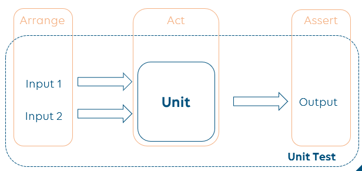
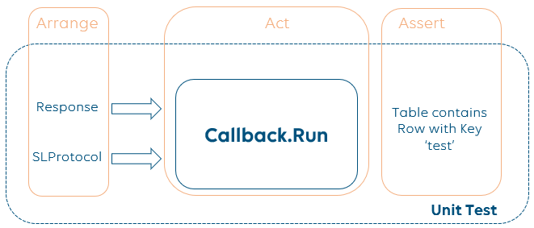

# UnitTestingFramework

The Unit Testing Framework was developed to simplify how Unit Tests are made when developing Connectors.
The purpose is to allow developers to focus on actual tests without being tied to the code implementation of the method that's being tested.

## Unit Tests
A Unit test is a way of testing a unit. Each test can be divided in 3 steps:

* Arrange: Prepare test logic and inputs;
* Act: run targeted unit;
* Assert: check if output matches expected result.

Ideally, units should be self-contained and for a set of inputs, it provides a set of outputs:


However, developers are also presented with legacy code or complex routines that force our Unit to be complex to a point where inter-process communication (calls to SLProtocol) are part of it.
This forces developers to mock the SLProtocol process to be able to run the target Unit.
Consider the example below, where we wish to test if when we run Unit *Callback.Run(SLProtocol protocol, HttpResponse response)*, the data is successfully set on a Table:



Translating the graph into code using our normal approach, it will look similar to the following:

```csharp
[TestMethod()]
[DeploymentItem(@"TestFiles\response_content.xml")]
public void TestCallback()
{
    // Arrange
    var expectedRows = new List<object[]>
    {
        new MediainstancesusagetableQActionRow
        {
            Mediainstancesusagetableid_2401 = "test",
            Mediainstancesusagetablemedianame_2402 = "Media Name",
            Mediainstancesusagetablemediatype_2403 = "Media Type",
            Mediainstancesusagetablemediasetname_2404 = "Set Name",
            Mediainstancesusagetableavailability_2405 = 100,
            Mediainstancesusagetableearliestusagelist_2406 = "Usage List",
            Mediainstancesusagetableearliestusagelistuid_2407 = "1234",
            Mediainstancesusagetableearliestusagetime_2408 = 0.0d
        }.ToObjectArray(),
    };

    string responseContent = File.ReadAllText("response_content.xml");
    var response = new HttpResponse("uri", "HTTP1.1 200 OK", responseContent);
    var protocolMock = new Mock<SLProtocolExt>();
    var callback = new GetMediaUsageByUtRangeResponse();

    // Act
    callback.Run(protocolMock.Object, response);
    
    // Assert
    protocolMock.Verify(p => p.FillArray(Parameter.Mediainstancesusagetable.tablePid, expectedRows, NotifyProtocol.SaveOption.Full));
}
```

By using this approach we can see multiple problems:

1. If in the future the method `callback.Run(SLProtocol protocol, HttpResponse response)` executes a protocol.NotifyProtocol instead of a protocol.FillaArray call, the unit test will break;
2. The format of the arguments used in the FillArray of the Verify need to be exactly the same as the format of the arguments of the FillArray call inside the method `callback.Run(SLProtocol protocol, HttpResponse response)`.
3. If the developer wishes to just check the row key or the table row length, the Verify will require the developer to build exactly the same arguments, forcing the developer to spend way more time than needed.

By using the Unit Testing Framework, we can achieve the same goal but just simply doing the following:

```csharp
[TestMethod()]
[DeploymentItem(@"TestFiles\response_content.xml")]
public void TestCallback()
{
    // Arrange
    var protocolModel = new ProtocolModelExt(path);
    var protocolMock = new SLProtocolMock(protocolModel);    

    string responseContent = File.ReadAllText("response_content.xml");
    var response = new HttpResponse("uri", "HTTP1.1 200 OK", responseContent);
    var callback = new GetMediaUsageByUtRangeResponse();

    // Act
    callback.Run(protocolMock.Object, response);
    
    // Assert
    mock.Assert()
        .Table(Parameter.Mediainstancesusagetable.tablePid)
        .Column(Parameter.Mediainstancesusagetable.Pid.mediainstancesusagetableid_2401)
        .Should()
        .Contain("test");
}
```

For this particular example, the change appears to be minimal, but the fact is that the Assert step is not tied to any specific SLProtocol call. This means that if one day, the developer wishes to refactor the method `callback.Run(SLProtocol protocol, HttpResponse response)`, the unit test will remain valid and will be a tool to validate whether the refactoring kept the same functionality as before or not.
Additionally, if the developer wishes to test the logic with a larger response that will result in hundreds of rows in a table, he/she will be able to validate the row length and target specific rows without having to build the hundreds of QActionRow objects and feed it into the Verify method.

Of course, this is a simple use case, but the Unit Testing Framework was made to link any Parameter and Table related calls to a cache, where all data is saved  and can be accessed during the test execution.
The main components of this framework are:
- The [SLProtocolMock](./Docs/SLProtocolMock.md) class;
- A [ProtocolCache](./Docs/ProtocolCache.md) where information about the parameters and tables is kept;
- A model for protocols ([ProtocolModelExt](./Docs/ProtocolModelExt.md)) to load their parameters and tables to the cache;
- A handler for Unit Tests assertions ([AssertionHandler](./Docs/AssertHandler.md));

Below we explain a bit more how we can access that cached values during the test execution and how we can use them to execute assertions on parameters and tables.

## How to Assert a Parameter
To get started, you need to load an instance of the ProtocolModelExt containing the protocol.xml data.
You can choose whether you provide a path to the protocol.xml or not  (these two options are explained in more detail in [ProtocolModelExt](./Docs/ProtocolModelExt.md)).

Afterwards, you are required to create an instance of the `SLProtocolMock`. This will behave as an extended `Mock<SLProtocol>` instance and it can then be used to invoke the methods. The following example requires the ProtocolModel to have a Parameter with ID 1000.

To check in Unit Tests if data is changing according to the expected, the Assertion mechanism can be used.
In the example below, we are testing if calling `mock.Object.SetParameter(1000, 30)` has actually resulted in changing the parameter with ID 1000 to value 30:

```csharp
# SetParameter
// Create a new Protocol Model
var protocolModel = new ProtocolModelExt(path);

// Create a new SLProtocolMock and pass it the Protocol Model 
var mock = new SLProtocolMock(protocolModel);    

// Make a call using the mock object, here in this example we are changing the value of Parameter with ID 1000 to 30
mock.Object.SetParameter(1000, 30);

// Invoke the mock assert method, select the ID of the Parameter to check and its current value, 
// comparing it with the expected value which should be passed in the Be call
mock.Assert().Parameter(1000).Value.Should().Be(30);
```

When calling `mock.Assert().Parameter(1000)` we're targeting our assert action to Parameter with ID 1000 by fetching its
current cached value. Using [Fluent Assertions](https://fluentassertions.com/), we're able to validate whether the
parameter value is 30 or not. Instead, if the following call was also made before the assertion, the test should fail:

```csharp
mock.Object.SetParameter(1000, 40);
```

Instead of asserting the Parameter based on its ID, we can use its name, [SetParameterByName](./Docs/ParametersCache.md). The following example requires the ProtocolModel to have a Parameter with name "NumericParameter":

```csharp
# SetParameterByName
// Create a new Protocol Model
var protocolModel = new ProtocolModelExt(path);

// Create a new SLProtocolMock and pass it the Protocol Model 
var mock = new SLProtocolMock(protocolModel);    

// Make a call using the mock object, here in this example we are changing the value of Parameter with name "NumericParameter" to 30
mock.Object.SetParameterByName("NumericParameter", 30);

// Invoke the mock assert method, select the name of the Parameter to check and its current value, comparing it with the expected value which should be passed in the Be call
mock.Assert().Parameter("NumericParameter").Value.Should().Be(30);
```

If there are many Parameters to be set, we can use the following method to set multiple Parameters, [SetParameters](./Docs/ParametersCache.md). The  example requires the ProtocolModel to have Parameters with ID 1000 and 1001:

```csharp
# SetParameters
// Create a new Protocol Model
var protocolModel = new ProtocolModelExt(path);

// Create a new SLProtocolMock and pass it the Protocol Model 
var mock = new SLProtocolMock(protocolModel);    

// The IDs of the Parameters to be set
int[] parametersIDs = { 1000, 1001 };

// The values to be set
object[] values = { 30, "newValue" };

// Make a call using the mock object, here in this example we are changing the values of Parameter with IDs 1000 and 1001 to 30 and "newValue", respectively
mock.Object.SetParameters(parametersIDs, values);

// Invoke the mock assert method, select the ID of the Parameter to check and its current value, comparing it with the expected value which should be passed in the Be call
mock.Assert().Parameter(1000).Value.Should().Be(30);
mock.Assert().Parameter(1001).Value.Should().Be("newValue");
```
The SLProtocol methods available are described in [ParametersCache](./Docs/ParametersCache.md) and [TablesCache](./Docs/TablesCache.md). The [Reference Sheet](./Docs/ReferenceSheet.md) contains examples of how to use the framework in Unit Tests.

## How to Assert a Table
The approach to Table assertions is similar to Parameter assertions: both require a Protocol Model to initialize the SLProtocolMock class, which contains the parameters and tables to be tested. 

After having the SLProtocolMock class instantiated, it can then be used to invoke the Table related methods, [Row](./Docs/ITableModelReader.md) and [Column](./Docs/ITableModelReader.md). The following example requires the ProtocolModel to have a Table with ID 900 and five columns, with the first column having the primary keys.

```csharp
# AddRow
// Create a new Protocol Model
var protocolModel = new ProtocolModelExt(path);

// Create a new SLProtocolMock and pass it the Protocol Model 
var mock = new SLProtocolMock(protocolModel);    

// The row to be set
object[] row = new object[] { "one", "two", "three", "four", "five" };

// Make a call using the mock object, here in this example we are adding the row to the table with ID 900
mock.Object.AddRow(900, row);

// Invoke the mock assert method, select the ID of the Table and the row (it can be selected by the primary key or the row index, both options return the same row), and then compare it with the expected row using one of the following options
mock.Assert().Table(900).Row("one").Should().Equal(row);
mock.Assert().Table(900).Row(0).Should().Equal(row);
mock.Assert().Table(900).Row("one").Should().Contain("one").And.Contain("two").And.Contain("three").And.Contain("four").And.Contain("five");
```

There is also the possibility of checking an entire column, not only a row. To do that we can select the column to be asserted by its Column ID. In the following example, we assume the Protocol Model has 5 columns with IDs 901, 902, 903, 904 and 905:

```csharp
# AddRow
// Create a new Protocol Model
var protocolModel = new ProtocolModelExt(path);

// Create a new SLProtocolMock and pass it the Protocol Model 
var mock = new SLProtocolMock(protocolModel);    

// The row to be set
object[] row1 = new object[] { "one.1", "two.1", "three.1", "four.1", "five.1" };
object[] row2 = new object[] { "one.2", "two.2", "three.2", "four.2", "five.2" };

// Make a call using the mock object, here in this example we are adding two rows, row1 and row2, to the table with ID 900
mock.Object.AddRow(900, row1);
mock.Object.AddRow(900, row2);

// Define the expected column values
string[] expectedColumn1 = { "one.1", "one.2" };
string[] expectedColumn2 = { "two.1", "two.2" };
string[] expectedColumn3 = { "three.1", "three.2" };
string[] expectedColumn4 = { "four.1", "four.2" };
string[] expectedColumn5 = { "five.1", "five.2" };

// Invoke the mock assert method, select the ID of the Table and the column to check, and then compare it with the expected column
mock.Assert().Table(900).Column(901).Should().Equal(expectedColumn1);
mock.Assert().Table(900).Column(901).Should().Equal(expectedColumn2);
mock.Assert().Table(900).Column(901).Should().Equal(expectedColumn3);
mock.Assert().Table(900).Column(901).Should().Equal(expectedColumn4);
mock.Assert().Table(900).Column(901).Should().Equal(expectedColumn5);
```

If we only want to assert the value of a Table cell, not an entire row or column, we can test it as follows:

```csharp
# AddRow
// Create a new Protocol Model
var protocolModel = new ProtocolModelExt(path);

// Create a new SLProtocolMock and pass it the Protocol Model 
var mock = new SLProtocolMock(protocolModel);    

// The row to be set
object[] row = new object[] { "one", "two", "three", "four", "five" };

// Make a call using the mock object, here in this example we are adding the row to the table with ID 900
mock.Object.AddRow(900, row);

// Invoke the mock assert method, select the ID of the Table and the row (it can be selected by the primary key or the row index, both options return the same row), specify the row index, and then compare it with the expected row using one of the following options
mock.Assert().Table(900).Row("one")[1].Should().BeEquivalentTo("two");
mock.Assert().Table(900).Row(0)[1].Should().BeEquivalentTo("two");
```

More examples of the assertion mechanism are available in [AssertHandler](./Docs/AssertHandler.md).
